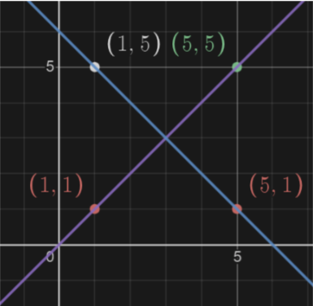
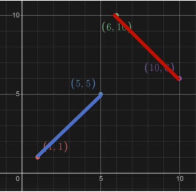
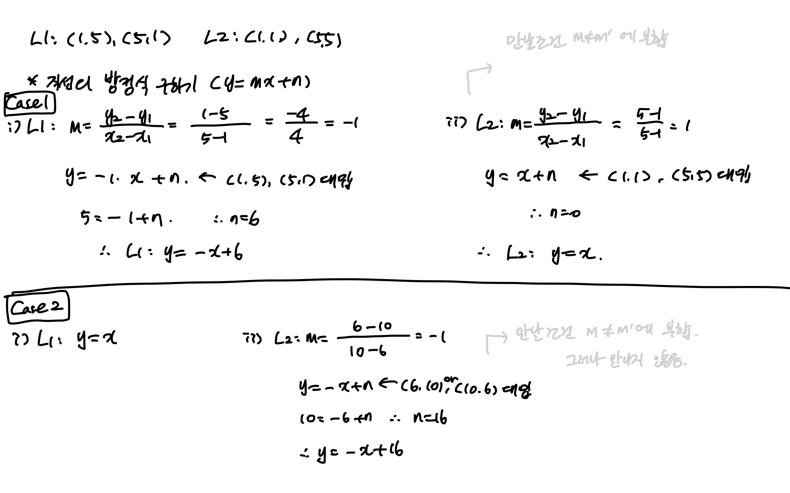
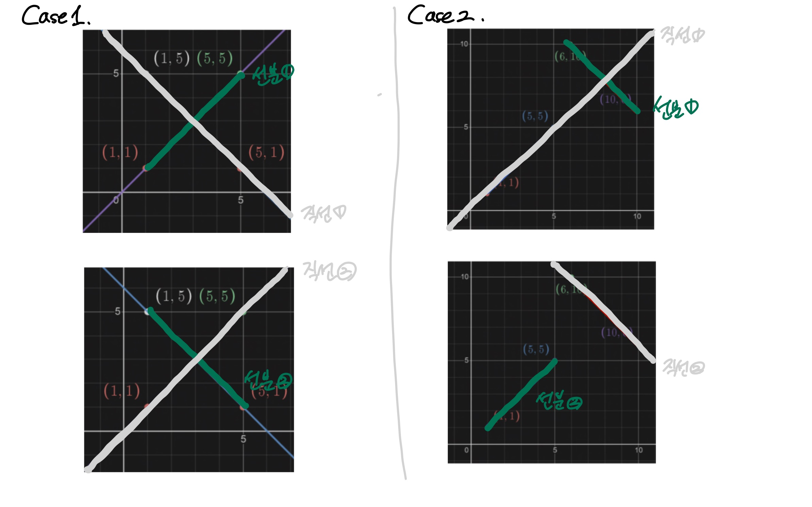
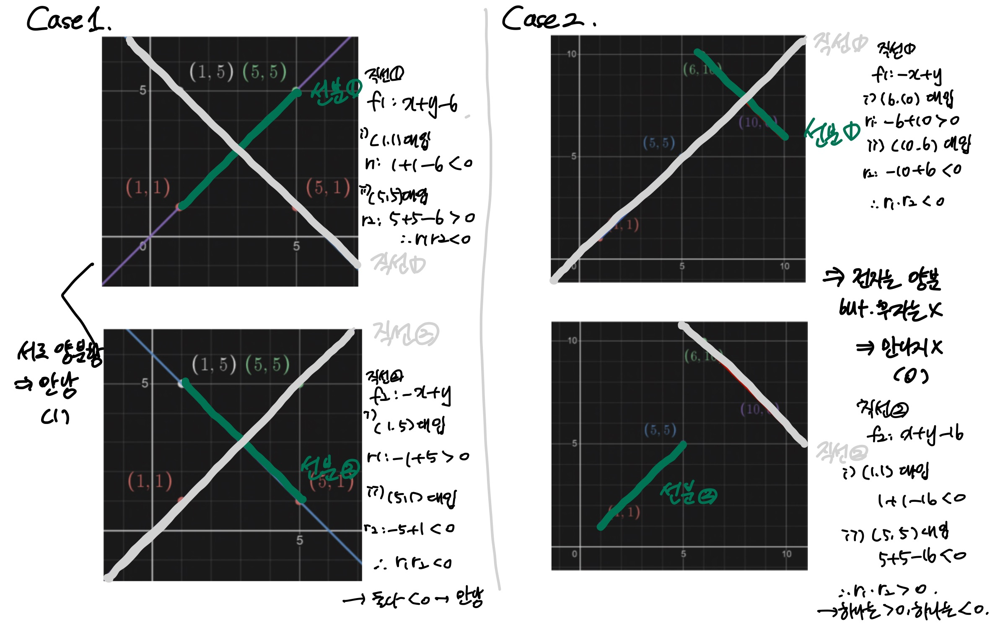
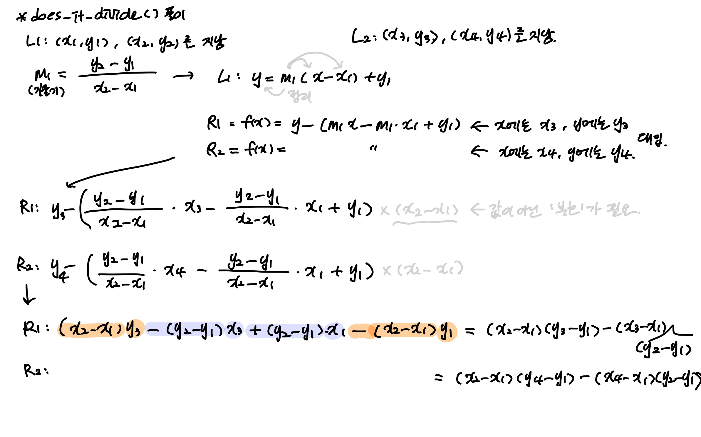

# week 1 (21.09.05~21.09.18)
## 문제 상
### <선분 교차>
2차원 좌표 평면 위의 두 선분 L1, L2가 주어졌을 때, 두 선분이 교차하는지 아닌지 알아보기
- 선 L1 : x1, y1, x2, y2
- 선 L2 : x3, y3, x4, y4
- 1,000,000 <= x1, x2, x3, x4, y1, y2, y3, y4 <= 1,000,000이며, 변수는 모두 정수
  
L1과 L2가 교차하면 1  
L2와 L2가 교차하지 않으면 0
 

### 문제 푸는 과정
과  가 있다고 가정하자.
 
위 두 직선이 가질 수 있는 조건은 다음과 같다.
1. 만날 조건 : 
2. 평행 조건 : 
3. 일치 조건 : 
4. 수직 조건 : 

 

위의 조건들을 갖고 L1: (1, 5), (5, 1)과 L2: (1, 1), (5, 5)에 대입했다.  

L1는 ,
L2는 로 위의 1번에 조건에 해당하여 만날 조건이 성사되었다.

 
하지만 두번째 가정에서 어긋났다.  
L1: (1, 1), (5, 5), L2: (6, 10), (10,6)을 지난다고 가정했을 때, 두 점을 지나는 직선이라고 가정한다면 위의 조건이 성립하지만, 선분이기 때문에 두 선분은 만나지 않았다.  

__*직선은 기울기가 다르기만 하면(평행하지 않을 때면) 교차하게 되는데, 선분이라 길이가 정해져 있는걸 간과했다.*__

 그래서 다른 방법을 고민했다.

### 위 가정에서 확대해보기
만약, 둘 다 선분이라고 가정하지 말고, 하나의 직선과 하나의 선분으로 이루어졌다고 생각해보자.  
직선 하나가 다른 선분을 둘로 나누면 만난다고 생각할 수 있지 않을까?  

즉, L1과 L2의 선분을 확장한 직선을 직선1, 직선2라고 가정하자.  
직선1에 의해 L2가 나누어진다면, 또 반대로 직선2에 의해 L1이 둘로 나누어진다면 둘은 만나다고 할 수 있지 않겠냐는 것이다.  
처음 가정에서 확대하여, 두 기울기가 서로 다르면, 즉 곱한 두 기울기가 0보다 작으면 직선 두개는 만난다고 볼 수 있겠다.  
*(f(x)=0라는 직선이 있다고 할 때, 두 점을 각각 넣어 기울기가 반대인 것을 확인하면 된다.)*

-> 직선을 기준으로 각각 반대 방향에 있으면 되지 않나?

### 결과

