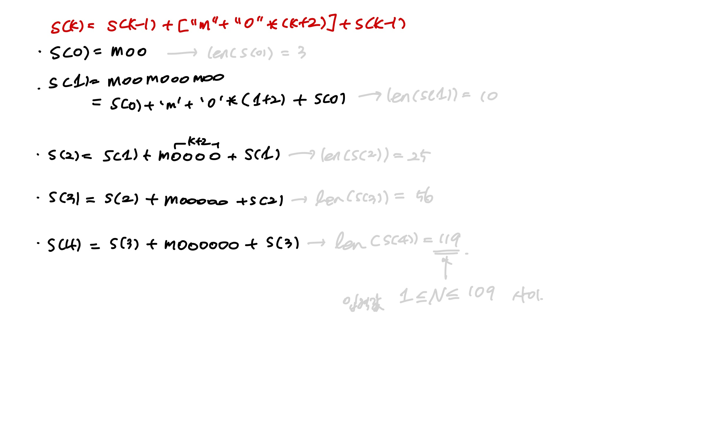

# week 3 (21.09.19 ~ 21.10.02)

## 문제 상

### <[Moo 게임](https://www.acmicpc.net/problem/5904)>
재귀적이고 길이가 무한대인 수열
S(k) = S(k-1) + [“m” + “o” * (k+2)] + S(k-1)
- S(0) = "m o o"
- S(1) = "m o o m o o o m o o" = "m o o" + "m o o o" + "m o o"  
    = S(0) + "o"가 (1(k)+2)개인 수열 "m o o o" + S(0)
- S(2) = "m o o m o o o m o o m o o o o m o o m o o o m o o"   
    = "m o o m o o o m o o" + "m o o o o" + "m o o m o o o m o o“   
    =  S(1) + "o"가 (2(k)+2)개인 수열 "m o o o o" + S(1)
- 입력: N (1 ≤ N ≤ 109)
- 출력: Moo 수열의 N번째 글자  

11 입력시, m 출력

### 문제 푸는 과정

일단 문제에 "재귀적"이라는 힌트가 있어서 재귀함수를 쓰면 되겠다고 생각했다.  
하지만 문제 푸는 순간에는 재귀함수 구현이 생각나지 않았다.  
그래서 노가다로 하나하나 구현할 생각을 해보았다.

노가다로 구현하기에 앞서, 약간의 편법(?)을 썼다.  
문제에서 입력값인 N은 1부터 109로 주어진다고 했는데, Moo 수열의 길이를 일단 구해보았다.

k의 값이 4인 경우, 수열의 길이가 119가 되면서 입력값 N의 최대값 109보다 큰 것을 확인했다.  
moo 수열은 무한수열인 것을 알지만, 입력값이 한정되어있는데 무한으로 만들어내는건 메모리 낭비인 것 같아 k=4인 moo 수열이라고 가정하고 진행했다.

각 함수에 대해 설명을 해보자면 다음과 같다.
1. mk_moo() : 가운데 'm'+'o' * (k+2) 생성해주는 함수
2. mk_seq() : S(1) = [moo] + 'mooo' + [moo] = S(0) + mk_moo(1) + S(0)과 같은 리스트 만들어 줌
3. moo_sequence() : mk_seq으로 반환받은 값들을 차곡차곡 반환받아서 S(1), S(2), S(3)..등에 저장해주고, 결과적으로 S(4)를 반환
4. main() : 메인함수에서는 N값을 입력받아 moo_sequence()[num-1] 를 print해줌

진짜 하나하나 억지로 구현한 티가 난다.  
또한 문제에서는 문자열로 제시를 해줬는데, 굳이굳이 리스트로 구현을 왜 했는지 모르겠다.   
그리고 구현하는 도중에 재귀함수를 활용하는 방법이 생각이 났지만, 이왕 시작한거 끝을 내기 위해 구현했다.  

### 재귀 함수 이용하기
뒤늦게 재귀함수 구현 방법이 떠올랐고, moo() 함수를 새로 추가해줬다.  
코드가 매우 깔끔해진 것을 확인할 수 있다.

### 개선 사항
진짜 무한 수열이라고 생각하고, N값의 범위가 주어지지 않았을때도 고려해볼 것.  
이때는 함수의 길이를 자동으로 계산하고, 내가 생각한 것과 비슷하게 그 길이까지만 수열을 생성하면 될 것으로 판단.  
추후 이 부분도 개선하여 업데이트 하겠다.
